<picture>
  <source media="(prefers-color-scheme: dark)" srcset="terminal-header.svg">
  <source media="(prefers-color-scheme: light)" srcset="terminal-header-light.svg">
  
</picture>

<br>

<details>
<summary><code>❯ ls -la ~/projects</code></summary>

<br>

```bash
drwxr-xr-x  barq/           # Free-threaded HTTP framework
drwxr-xr-x  mirrorwork/     # AI resume gap analysis
drwxr-xr-x  qalam/          # Writing tools
```

<table>
<tr>
<td width="50%">

### ⚡ [barq](https://github.com/grandimam/barq)

HTTP framework for **free-threaded Python 3.13+**

No async. No GIL. Just threads.

```diff
+ 2-5x faster than FastAPI
+ 621 lines of pure Python
+ Radix router, DI, Pydantic
```

</td>
<td width="50%">

### 🪞 [mirrorwork](https://github.com/grandimam/mirrorwork)

AI-powered career gap analysis

Upload resume → Match jobs → Get improvements

```
FastAPI + Claude + React
```

</td>
</tr>
</table>

</details>

<details>
<summary><code>❯ cat ~/.config/principles</code></summary>

<br>

```python
PRINCIPLES = {
    "code": "less is more",
    "abstraction": "earn it, don't assume it",
    "typing": "heavy, always",
    "structure": "flat over nested",
    "complexity": "delete it",
}

def should_write_code(feature: str) -> bool:
    """Most code shouldn't exist."""
    return absolutely_necessary(feature)
```

</details>

<details>
<summary><code>❯ cat ~/interests.txt</code></summary>

<br>

```
→ Free-threaded Python (PEP 703)
→ Systems from scratch — HTTP servers, parsers, routers
→ Performance without sacrificing simplicity
→ The GIL-free future
```

</details>

<details>
<summary><code>❯ ./contact --help</code></summary>

<br>

```
USAGE: ./contact [OPTIONS]

OPTIONS:
    --email     hello@grandimam.com
    --blog      blog.grandimam.com
    --twitter   @grandimam

FLAGS:
    --open-to   collaborations, python tooling, systems problems
```

[](mailto:hello@grandimam.com)
[](https://blog.grandimam.com)
[](https://twitter.com/grandimam)

</details>

<details>
<summary><code>❯ history | tail -5</code></summary>

<br>

```
1024  mass-delete abstractions
1025  git push --force-with-lease (after review)
1026  benchmark barq vs fastapi (again)
1027  remove 200 lines, keep functionality
1028  coffee && code
```

</details>

---

<sub>

```
❯ fortune | cowsay
 _______________________________________
< Building foundations others ship on. >
 ---------------------------------------
        \   ^__^
         \  (oo)\_______
            (__)\       )\/\
                ||----w |
                ||     ||
```

</sub>
